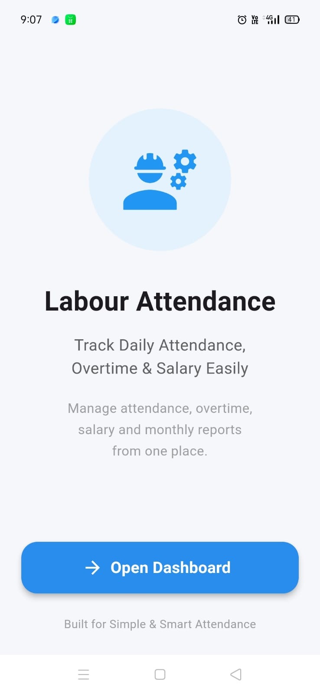
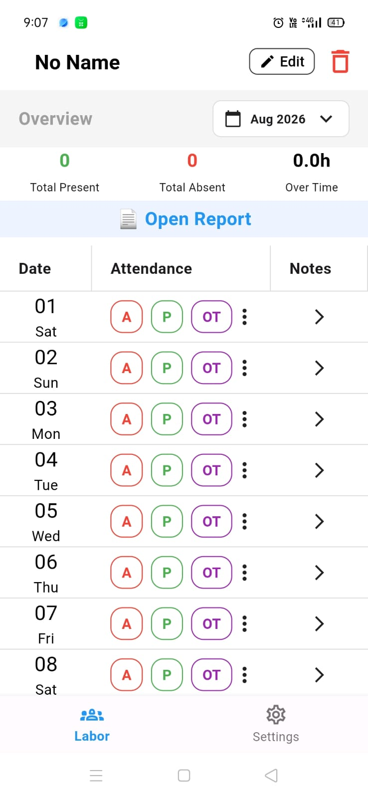
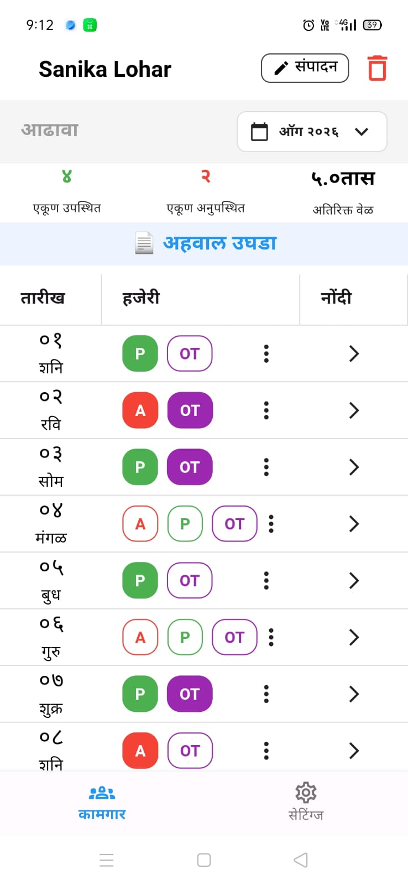

# 📱 Flutter Attendance & Salary Management App

A mobile attendance management application built using Flutter.

The app allows users to manage daily attendance, overtime, salary, and employee settings with a clean and user-friendly interface.

## ✨ Features

- 📅 **Attendance Calendar** — View and manage daily and monthly attendance records
- ✅ **Present / Absent Attendance** — Mark and track employee attendance
- ⏱️ **Overtime Management** — Track and manage overtime hours
- 💰 **Salary Calculation** — Calculate salary based on attendance and overtime
- 📄 **Salary Slip PDF** — Generate salary slips in PDF format
- 📝 **Attendance Notes** — Add notes and additional information for attendance records
- ⚙️ **Employee Settings** — Manage employee and attendance-related settings
- 🔐 **Biometric App Lock** — Secure the application using biometric authentication
- 🌐 **Marathi & English Support** — Switch between Marathi and English
- 💾 **Local Data Storage** — Store application data locally using Hive
- 📊 **Attendance Reports** — View attendance and overtime information

---

## 📱 Screenshots

### 🏠 Dashboard & Attendance

<p align="center">
  
  
  
</p>

### ⏱️ Attendance & Overtime

<p align="center">
  
  
  
</p>

### 💰 Salary Management

<p align="center">
  
  
  
</p>

### ⚙️ Settings & Security

<p align="center">
  
  
  
</p>

---

## 🛠️ Tech Stack

* Flutter
* Dart
* Hive
* SharedPreferences
* Local Authentication
* REST API
* Spring Boot
* MySQL

---

## 📂 Project Structure

```text
lib/
├── screens/
├── services/
├── models/
├── widgets/
└── main.dart
```

## 🚀 Getting Started

### Install dependencies

```bash
flutter pub get
```

### Run the application

```bash
flutter run
```

---

## 👩‍💻 Developer

**Sanika Lohar**

Flutter Developer | Angular Developer
